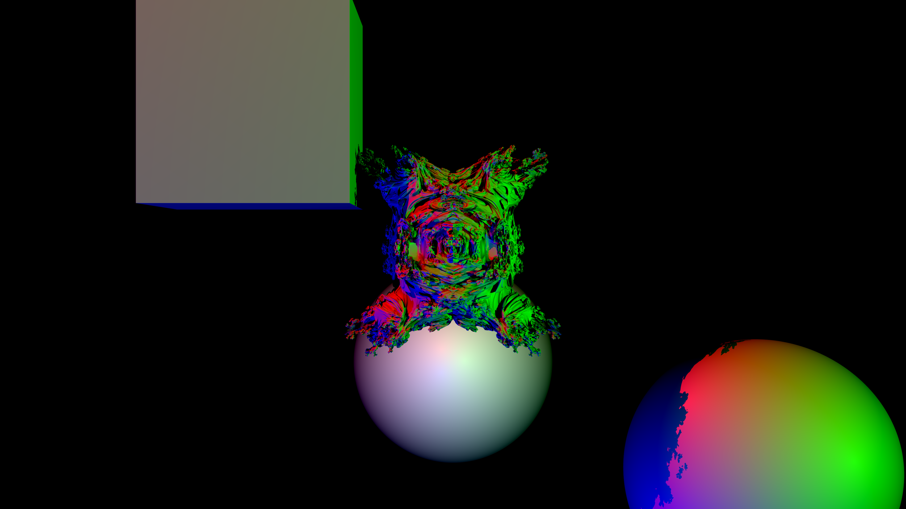

# go-ray-march

This is a multi-threaded ray marching renderer written in Golang that allows for the creation of a scene (including lighting, basic shapes and a MandleBulb) and rendering to an image file on disk.



## Features

- Multi-threaded rendering
- Different shapes (Sphere, Cube, MandleBulb)
- Lighting
- Image export

## Future Goals

- Add more advanced shading/lighting & reflections
- Add scene builder outside of renderer code
- Add ability to create videos
- Real-time rendering preview window
- Basic GUI

## Requirements

- Golang

## Installation

1. Clone the repository

```bash
git clone https://github.com/Solidsilver/go-ray-march.git
```

2. Build the project (make sure Go is installed)

```bash
go build -o go-ray-march ./cmd/image_render/image_render.go
```

## Usage

You may run the standalone executible, or import into your own package.

To run a basic render,:

```bash
go run ./cmd/image_render/image_render.go
```

To use go-ray-march in your own project, simply import the `renderer` package and use the features provided. Example usage can be found at the end of the `renderer/renderer.go` file.

## Contributing

1. Fork the repository
2. Create a new branch with a meaningful name (`git checkout -b new-feature`)
3. Commit your changes (`git commit -am 'Adding a new feature'`)
4. Push to the branch (`git push origin new-feature`)
5. Create a Pull Request

## License

MIT License © Solidsilver
